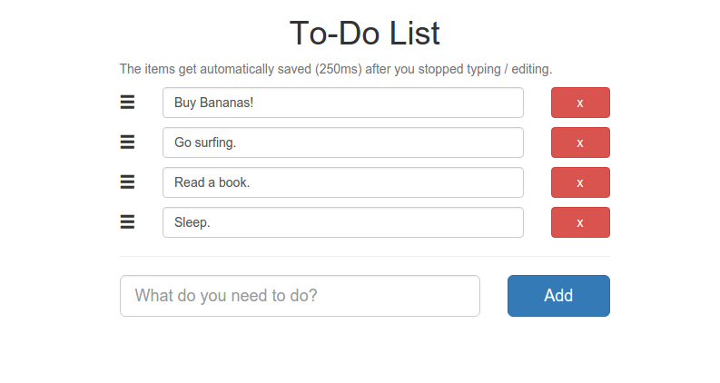

# To-Do List
A simple To-Do List.

## Installation
* Navigate to your development directory (ex.: `cd /var/www/html/`)
* Clone this project `git clone https://github.com/bobalazek/to-do-list`
* Navigate to the project: `cd to-do-list`
* Run `composer install` (install [composer](https://getcomposer.org/doc/00-intro.md#globally), if you haven't already)
* Create the database file: `touch app/data/app.db`
* Open your browser and install the database `http://localhost/to-do-list/database/install`
* Done. Start "To-Do-ing"

## Clear database
To clear the database just go to `http://localhost/to-do-list/database/clear`

## Preview

